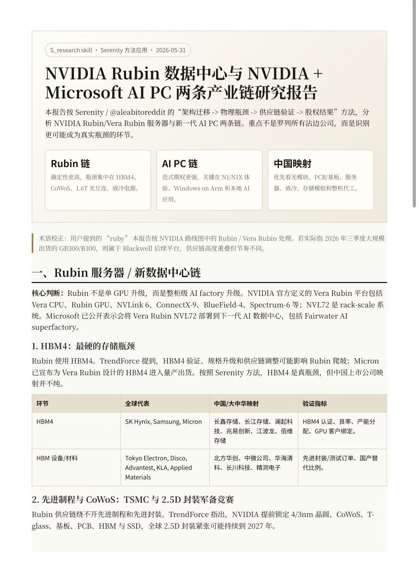
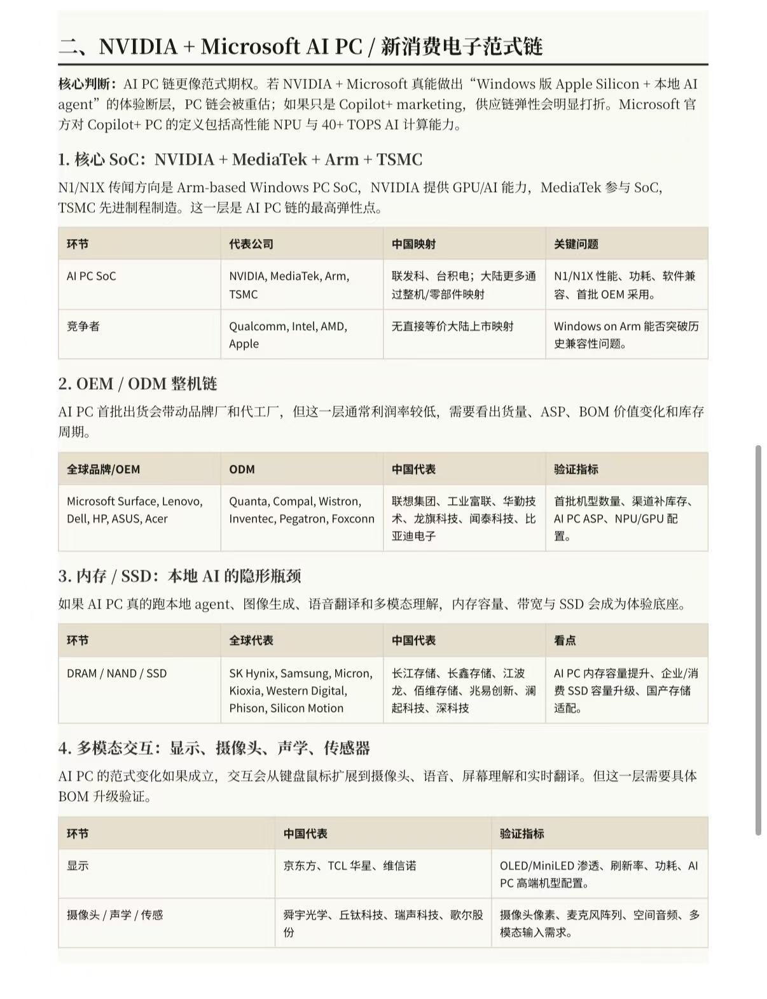

# S Research Skill / S_research 研究技能

**English:** A Codex skill for Serenity-style source cleanup, thesis extraction, industry-chain analysis, China-company benchmarking, and HTML/PDF research report generation.

**中文：** 这是一个用于 Codex 的研究技能，支持 Serenity 风格的信息清洗、投资框架提炼、产业链分析、中国企业对标，以及 HTML/PDF 研究报告输出。

---

## What This Skill Does / 这个 Skill 能做什么

**English**

This skill has two main modes:

1. **Author-only X research workflow**
   - Clean X/Twitter timeline exports.
   - Extract status IDs, dates, post types, author text, quoted context, and tickers.
   - Separate direct author evidence from quoted posts, UI noise, third-party summaries, and analyst inference.
   - Tag posts by sector and thesis labels.

2. **Industry deep-dive workflow**
   - Analyze architecture migration, real bottlenecks, value-chain structure, and equity-relevant outcomes.
   - Benchmark global leaders against representative Chinese companies.
   - Rank industry-chain segments by bottleneck quality and investment relevance.
   - Generate structured HTML and PDF reports.

**中文**

这个 skill 主要有两种模式：

1. **作者本人 X 内容研究流程**
   - 清洗 X/Twitter 时间线导出数据。
   - 提取 status ID、日期、帖子类型、作者原文、引用内容和股票代码。
   - 区分作者本人内容、引用帖、界面噪音、第三方总结和分析推断。
   - 按产业板块和 thesis 标签进行分类。

2. **产业链深度研究流程**
   - 分析技术架构迁移、真实瓶颈、价值链结构和股权结果。
   - 将全球龙头企业与代表性中国企业进行对标。
   - 按瓶颈质量和投资相关性排序产业链环节。
   - 生成结构化 HTML 和 PDF 报告。

---

## Repository Structure / 仓库结构

```text
s-research-skill/
  SKILL.md
  agents/
    openai.yaml
  references/
    case-study-template.md
    china-company-benchmark.md
    report-output-template.md
    serenity-methodology.md
    taxonomy.md
  scripts/
    build_report_pdf.py
    clean_x_export.py
    fetch_status_details_cdp.mjs
    tag_ai_compute_chain.py
  .gitignore
  README.md
```

**English**

- `SKILL.md`: Main Codex skill instructions.
- `agents/openai.yaml`: UI-facing metadata.
- `references/`: Domain rules, templates, and methodology notes.
- `scripts/`: Reusable scripts for data cleanup, tagging, CDP fetching, and report generation.

**中文**

- `SKILL.md`：Codex 识别和使用该 skill 的核心说明文件。
- `agents/openai.yaml`：面向界面展示的元数据。
- `references/`：方法论、模板、分类体系和中国企业对标规则。
- `scripts/`：可复用脚本，包括数据清洗、标签分类、CDP 抓取和报告生成。

---

## Installation / 安装方式

**English**

Clone the repository into your Codex skills directory:

```bash
git clone https://github.com/qianbab/qianbaobao.git <codex-skills-dir>/s-research-skill
```

Replace `<codex-skills-dir>` with your local Codex skills directory.

**中文**

将仓库克隆到你的 Codex skills 目录：

```bash
git clone https://github.com/qianbab/qianbaobao.git <codex-skills-dir>/s-research-skill
```

请将 `<codex-skills-dir>` 替换为你自己的 Codex skills 目录。

Windows 示例：

```powershell
git clone https://github.com/qianbab/qianbaobao.git <codex-skills-dir>\s-research-skill
```

---

## Dependencies / 依赖

**English**

Core skill instructions work without extra dependencies. Some scripts require optional packages:

- `scripts/build_report_pdf.py` requires Python package `reportlab`.
- `scripts/fetch_status_details_cdp.mjs` requires Node package `playwright`.
- `fetch_status_details_cdp.mjs` also requires an already logged-in Chromium/Edge browser exposing a local CDP endpoint.

Install optional dependencies:

```bash
pip install reportlab
npm install playwright
```

**中文**

skill 的核心说明不需要额外依赖即可使用。部分脚本需要可选依赖：

- `scripts/build_report_pdf.py` 需要 Python 包 `reportlab`。
- `scripts/fetch_status_details_cdp.mjs` 需要 Node 包 `playwright`。
- `fetch_status_details_cdp.mjs` 还需要一个已经登录、并开启本地 CDP 端口的 Chromium/Edge 浏览器。

安装可选依赖：

```bash
pip install reportlab
npm install playwright
```

---

## Usage: X Export Cleanup / 用法：X 导出清洗

**English**

Clean a browser or timeline export:

```bash
python scripts/clean_x_export.py input.csv --out cleaned.csv --ticker-out ticker_frequency.csv
```

Tag cleaned rows by sector and thesis labels:

```bash
python scripts/tag_ai_compute_chain.py cleaned.csv --out tagged.csv --summary-out layer_summary.csv
```

Fetch fuller visible status-page text through a logged-in browser CDP session:

```bash
node scripts/fetch_status_details_cdp.mjs cleaned.csv --out status_details.csv
```

**中文**

清洗浏览器或时间线导出的 CSV：

```bash
python scripts/clean_x_export.py input.csv --out cleaned.csv --ticker-out ticker_frequency.csv
```

对清洗后的内容进行产业和 thesis 标签分类：

```bash
python scripts/tag_ai_compute_chain.py cleaned.csv --out tagged.csv --summary-out layer_summary.csv
```

通过已登录浏览器的 CDP 会话抓取更完整的 status 页面可见文本：

```bash
node scripts/fetch_status_details_cdp.mjs cleaned.csv --out status_details.csv
```

---

## Usage: Industry Report PDF / 用法：产业研究报告 PDF

**English**

Create a JSON report spec following `references/report-output-template.md`, then run:

```bash
python scripts/build_report_pdf.py report_spec.json --html report.html --pdf report.pdf
```

The script supports:

- Chinese and English text
- Cover metrics
- Headings
- Paragraphs
- Notes
- Bullet lists
- Tables
- Source lists

### PDF Output Preview / PDF 输出效果预览

**English:** The images below show example PDF-style report pages generated with the S_research workflow. They demonstrate the intended layout: cover metrics, thesis framing, section hierarchy, and China-company benchmark tables.

**中文：** 下图展示了使用 S_research 工作流生成的 PDF 风格报告页面示例，包括封面指标、核心 thesis、章节结构和中国企业对标表格。





**中文**

先按照 `references/report-output-template.md` 创建 JSON 报告规格文件，然后运行：

```bash
python scripts/build_report_pdf.py report_spec.json --html report.html --pdf report.pdf
```

该脚本支持：

- 中文和英文文本
- 封面指标
- 标题
- 段落
- 提示说明
- 项目符号列表
- 表格
- 来源列表

---

## Industry Research Framework / 产业研究框架

**English**

The S_research workflow emphasizes:

1. **Architecture migration**: What structural or technological shift is happening?
2. **Real chokepoint**: What is scarce, difficult, regulated, capacity-constrained, or hard to replicate?
3. **Supply-chain validation**: Which companies are directly exposed to the bottleneck?
4. **China benchmark**: Which Chinese companies are comparable, and where does the comparison break?
5. **Equity translation**: Who captures margin, who gets commoditized, and what milestones validate or invalidate the thesis?

**中文**

S_research 工作流重点关注：

1. **架构迁移**：产业正在发生什么结构性或技术性变化？
2. **真实瓶颈**：什么环节稀缺、困难、受监管、受产能约束，或难以复制？
3. **供应链验证**：哪些公司真正暴露在这个瓶颈上？
4. **中国企业对标**：哪些中国企业可以对标？对标在哪里成立，在哪里不成立？
5. **股权结果转化**：谁能获得利润，谁会被商品化，哪些里程碑会验证或推翻 thesis？

---

## China Company Benchmarking / 中国企业对标

**English**

When benchmarking Chinese companies, this skill prioritizes functional comparability over market-cap comparability. A company should be mapped to the value-chain segment where it actually competes.

Recommended comparison fields:

- Segment
- Bottleneck
- Global leaders
- Chinese companies
- Comparison logic
- Validation signals
- Risks

See `references/china-company-benchmark.md` for details.

**中文**

进行中国企业对标时，本 skill 优先考虑“功能对标”，而不是简单按市值或热度对标。企业应该被放在它真实参与竞争的产业链环节中。

推荐对标字段：

- 产业链环节
- 真实瓶颈
- 全球代表企业
- 中国代表企业
- 对标逻辑
- 验证信号
- 风险

详见 `references/china-company-benchmark.md`。

---

## Data and Privacy Notes / 数据与隐私说明

**English**

This public repository does not include:

- Raw X exports
- Cookies
- Browser profiles
- HAR files
- Login sessions
- Private notes
- Local machine paths

Do not commit private exports or browser-session artifacts. The `.gitignore` file excludes common temporary, browser, and export-related files.

**中文**

这个公开仓库不包含：

- X 原始导出数据
- Cookie
- 浏览器 profile
- HAR 文件
- 登录会话
- 私人笔记
- 本机绝对路径

请不要提交私人导出文件或浏览器会话文件。仓库中的 `.gitignore` 已经排除了常见临时文件、浏览器文件和导出数据。

---

## Limitations / 限制

**English**

- Browser timeline text can be truncated or contaminated by quoted posts and UI labels.
- X status-page fetching depends on login state, browser CDP availability, and visible-page content.
- Industry reports require up-to-date source verification when market data, company data, regulation, or product status may have changed.
- Investment-related output is research support only and is not personalized financial advice.

**中文**

- 浏览器时间线文本可能被截断，也可能混入引用帖和界面标签。
- X status 页面抓取依赖登录状态、浏览器 CDP 可用性和页面可见内容。
- 当市场数据、公司数据、监管状态或产品状态可能变化时，产业报告必须结合最新来源验证。
- 涉及投资的输出仅用于研究辅助，不构成个性化投资建议。

---

## Disclaimer / 免责声明

**English**

This repository is for research workflow automation and educational use. It does not provide investment, legal, medical, or financial advice. Users are responsible for verifying sources, respecting platform terms, and protecting private data.

**中文**

本仓库仅用于研究流程自动化和学习用途，不提供投资、法律、医疗或财务建议。使用者应自行核验来源，遵守平台规则，并保护私人数据。
